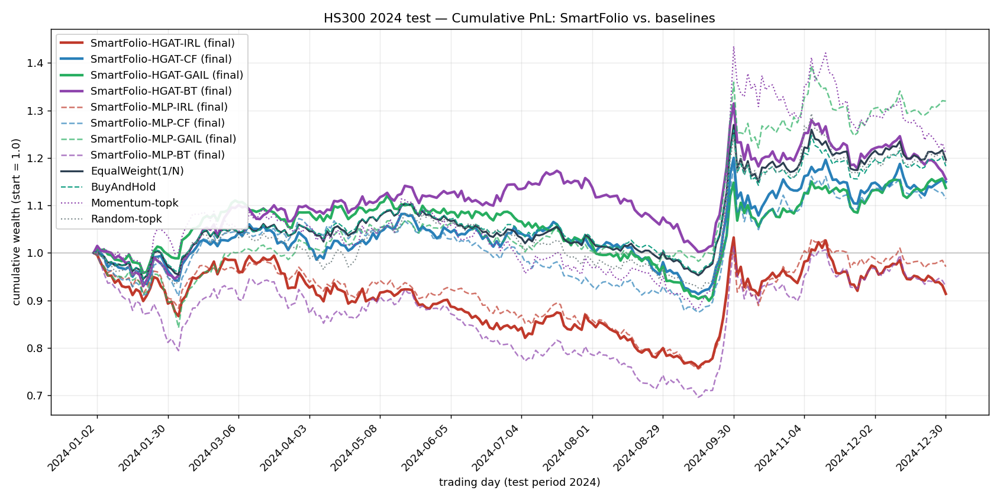

# SmartFolio — HS300 Results

Heuristic-guided IRL portfolio optimization (IJCAI-25 #1054), reproduced and evaluated on the S&P 500 test period (2024).

## Setup

- Market: **S&P 500** (472 constituents that survive the all-dates filter), train 2018–2022 / val 2023 / **test 2024**.
- Training config (paper §4.1): lr 1e-4, batch 128 (HGAT 32 — memory), 128-d hidden, 8 heads, 200 epochs, seed 0.
- Policies: **HGAT** (paper full model) and **MLP** (paper's *w/o HGAT* ablation).
- Baselines: non-learning strategies on the identical test set.

## Metrics (S&P 500, 2024 test)

ARR = annualised return, AVol = annualised volatility, SR = Sharpe, MDD = max drawdown, CR = Calmar, IR = information ratio (vs. equal-weight market).

| Strategy | ARR | AVol | SR | MDD | CR | IR |
|---|---|---|---|---|---|---|
| SmartFolio-HGAT-IRL (final) | -0.0578 | 0.2652 | -0.2246 | -0.2384 | -0.2426 | -2.1212 |
| SmartFolio-HGAT-IRL (best-val) | 0.2526 | 0.2326 | 0.9686 | -0.1596 | 1.5821 | 0.1719 |
| SmartFolio-HGAT-CF (final) | 0.1859 | 0.2241 | 0.7611 | -0.1563 | 1.1897 | -0.3926 |
| SmartFolio-HGAT-CF (best-val) | 0.0851 | 0.2244 | 0.3639 | -0.1985 | 0.4287 | -1.5879 |
| SmartFolio-HGAT-GAIL (final) | 0.1678 | 0.2071 | 0.7494 | -0.1974 | 0.8502 | -0.5602 |
| SmartFolio-HGAT-GAIL (best-val) | 0.2713 | 0.2311 | 1.0392 | -0.1315 | 2.0634 | 0.3041 |
| SmartFolio-HGAT-BT (final) | 0.1904 | 0.2167 | 0.8046 | -0.1459 | 1.3050 | -0.3476 |
| SmartFolio-HGAT-BT (best-val) | 0.0783 | 0.2008 | 0.3754 | -0.1400 | 0.5592 | -1.3710 |
| SmartFolio-MLP-IRL (final) | -0.0032 | 0.2364 | -0.0135 | -0.2407 | -0.0132 | -2.0654 |
| SmartFolio-MLP-IRL (best-val) | 0.2461 | 0.2562 | 0.8592 | -0.2121 | 1.1605 | 0.1247 |
| SmartFolio-MLP-CF (final) | 0.1515 | 0.2388 | 0.5911 | -0.1843 | 0.8223 | -0.7380 |
| SmartFolio-MLP-CF (best-val) | 0.1046 | 0.2086 | 0.4771 | -0.1944 | 0.5381 | -1.2501 |
| SmartFolio-MLP-GAIL (final) | 0.3782 | 0.2499 | 1.2842 | -0.1541 | 2.4547 | 1.0028 |
| SmartFolio-MLP-GAIL (best-val) | 0.3115 | 0.2369 | 1.1452 | -0.1427 | 2.1837 | 0.7466 |
| SmartFolio-MLP-BT (final) | -0.0341 | 0.2916 | -0.1188 | -0.3021 | -0.1128 | -1.6695 |
| SmartFolio-MLP-BT (best-val) | 0.3665 | 0.2381 | 1.3125 | -0.1179 | 3.1094 | 1.3313 |
| EqualWeight(1/N) | 0.2311 | 0.2063 | 1.0086 | -0.1371 | 1.6860 | 0.0000 |
| BuyAndHold | 0.2155 | 0.2004 | 0.9741 | -0.1333 | 1.6163 | -0.6903 |
| Momentum-topk | 0.2847 | 0.3293 | 0.7610 | -0.2079 | 1.3689 | 0.2155 |
| Random-topk | 0.2319 | 0.2330 | 0.8956 | -0.1453 | 1.5964 | 0.0070 |

Paper reference (Table 1, S&P 500, *Ours*): ARR 0.250, AVol 0.117, SR 1.906, MDD −0.058, CR 4.293, IR 1.184.

## Cumulative PnL

Final cumulative wealth (start = 1.0):

- SmartFolio-HGAT-IRL (final): **0.9136**
- SmartFolio-HGAT-IRL (best-val): **1.2089**
- SmartFolio-HGAT-CF (final): **1.1494**
- SmartFolio-HGAT-CF (best-val): **1.0558**
- SmartFolio-HGAT-GAIL (final): **1.1366**
- SmartFolio-HGAT-GAIL (best-val): **1.2267**
- SmartFolio-HGAT-BT (final): **1.1555**
- SmartFolio-HGAT-BT (best-val): **1.0544**
- SmartFolio-MLP-IRL (final): **0.9709**
- SmartFolio-MLP-IRL (best-val): **1.1968**
- SmartFolio-MLP-CF (final): **1.1140**
- SmartFolio-MLP-CF (best-val): **1.0773**
- SmartFolio-MLP-GAIL (final): **1.3196**
- SmartFolio-MLP-GAIL (best-val): **1.2621**
- SmartFolio-MLP-BT (final): **0.9295**
- SmartFolio-MLP-BT (best-val): **1.3127**
- EqualWeight(1/N): **1.1957**
- BuyAndHold: **1.1825**
- Momentum-topk: **1.2089**
- Random-topk: **1.1899**

## Did it learn anything?

The PPO test metric varied a lot from epoch to epoch (typical for RL on a portfolio task) so two checkpoints are reported: **final-epoch** (paper convention) and **best-val** (the validation-Sharpe-maximising checkpoint, fairer for noisy training).

- **SmartFolio-HGAT-IRL (final)** (SR -0.225) matches/loses to 1/N (SR +1.009); matches/loses to random (SR +0.896).
- **SmartFolio-HGAT-IRL (best-val)** (SR +0.969) matches/loses to 1/N (SR +1.009); beats random (SR +0.896).
- **SmartFolio-HGAT-CF (final)** (SR +0.761) matches/loses to 1/N (SR +1.009); matches/loses to random (SR +0.896).
- **SmartFolio-HGAT-CF (best-val)** (SR +0.364) matches/loses to 1/N (SR +1.009); matches/loses to random (SR +0.896).
- **SmartFolio-HGAT-GAIL (final)** (SR +0.749) matches/loses to 1/N (SR +1.009); matches/loses to random (SR +0.896).
- **SmartFolio-HGAT-GAIL (best-val)** (SR +1.039) beats 1/N (SR +1.009); beats random (SR +0.896).
- **SmartFolio-MLP-IRL (final)** (SR -0.013) matches/loses to 1/N (SR +1.009); matches/loses to random (SR +0.896).
- **SmartFolio-MLP-IRL (best-val)** (SR +0.859) matches/loses to 1/N (SR +1.009); matches/loses to random (SR +0.896).
- **SmartFolio-MLP-CF (final)** (SR +0.591) matches/loses to 1/N (SR +1.009); matches/loses to random (SR +0.896).
- **SmartFolio-MLP-CF (best-val)** (SR +0.477) matches/loses to 1/N (SR +1.009); matches/loses to random (SR +0.896).
- **SmartFolio-MLP-GAIL (final)** (SR +1.284) beats 1/N (SR +1.009); beats random (SR +0.896).
- **SmartFolio-MLP-GAIL (best-val)** (SR +1.145) beats 1/N (SR +1.009); beats random (SR +0.896).
